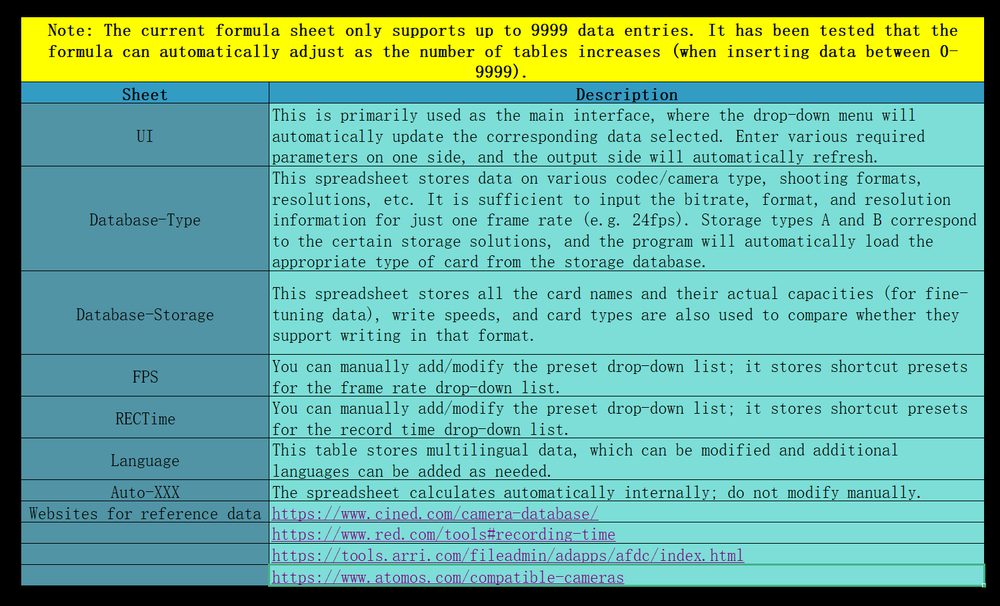
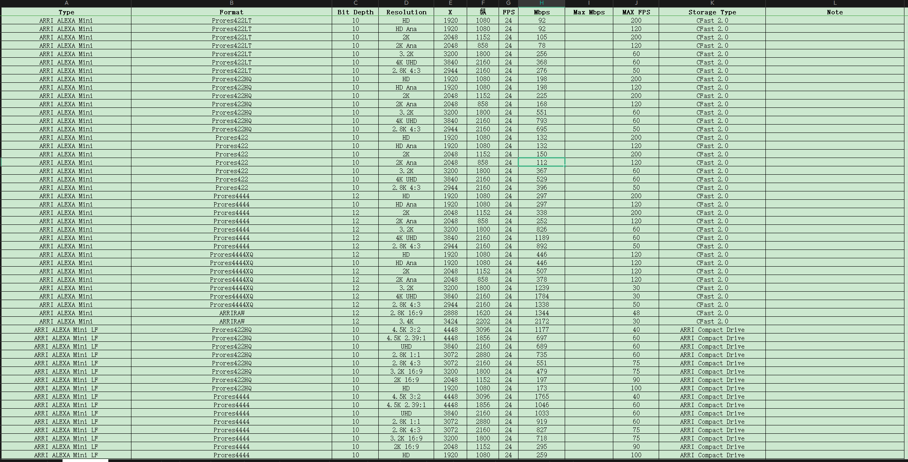
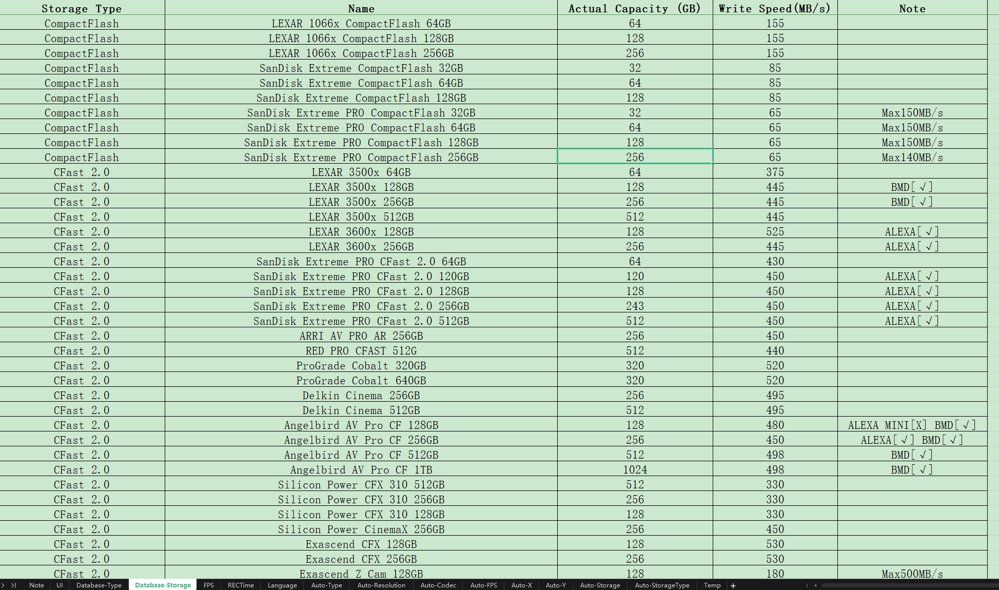

# Video Codec Rate Calculator

Purpose: An open source .xlsx file that you can calculate any form video RAW data . And you can manually add/remove any data anytime anywhere.

​​

# Project Introduction

## Features

An Excel spreadsheet that helps professionals in the film and television industry calculate the size, volume, and estimated storage time of any video codec. It allows for a fully customizable database and usage methods.

## Characteristics

* Flexible use, data can be modified at any time
* Completely offline, for local use
* Includes a database of camera video codecs and storage methods, allowing users to add and calculate the content they want.
* Can also be placed in WPS Cloud, accessible anytime via mobile phones, tablets, or any internet-enabled devices, and can be opened through a WeChat mini-program.
* Users familiar with Excel can fully customize and modify formulas and usage methods.
* Bilingual interface in Chinese and English, allowing for easy modification/retranslation of text, and users can add multiple languages on their own.

## Target Users

Suitable for cinematographers, editors, DITs, VFX artists, and other professionals.

# How to Use

​​

## Simple Use

Edit, modify, and add any data just like editing a spreadsheet. Various data types are already filled in the table, just follow the example to fill in.

​​

​​​​

# Websites for Data Lookup

1. [https://www.cined.com/camera-database/](https://www.cined.com/camera-database/)
2. [https://www.red.com/tools#recording-time](https://www.red.com/tools#recording-time)
3. [https://tools.arri.com/fileadmin/adapps/afdc/index.html](https://tools.arri.com/fileadmin/adapps/afdc/index.html)
4. [https://www.dpreview.com/products/cameras](https://www.dpreview.com/products/cameras)
5. [https://www.blackmagicdesign.com/products](https://www.blackmagicdesign.com/products)
6. [https://phfx.com/tools/framesToDataRate/](https://phfx.com/tools/framesToDataRate/)
7. [https://www.atomos.com/compatible-cameras/](https://www.atomos.com/compatible-cameras/)

# Support Me

If you find it useful, please support me. I will continue to update the database and maintain it. Buy me a cup of coffee!

## Ali Pay

​​

## Wechat Pay

​​
