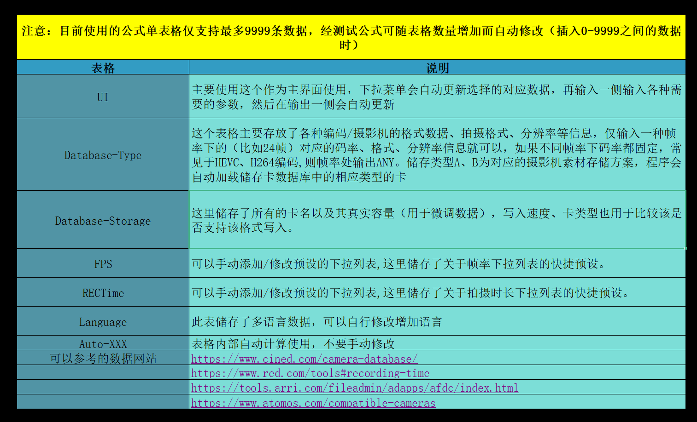
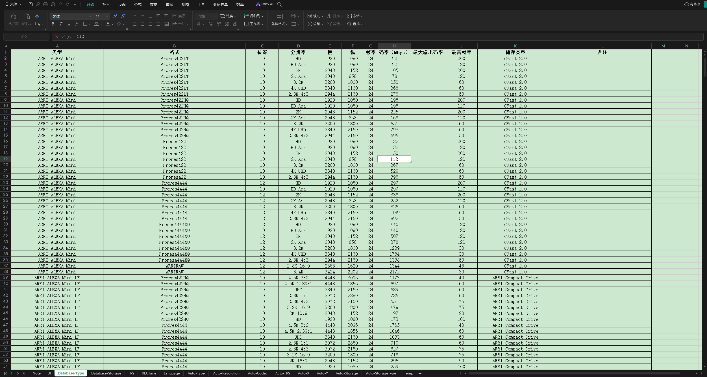
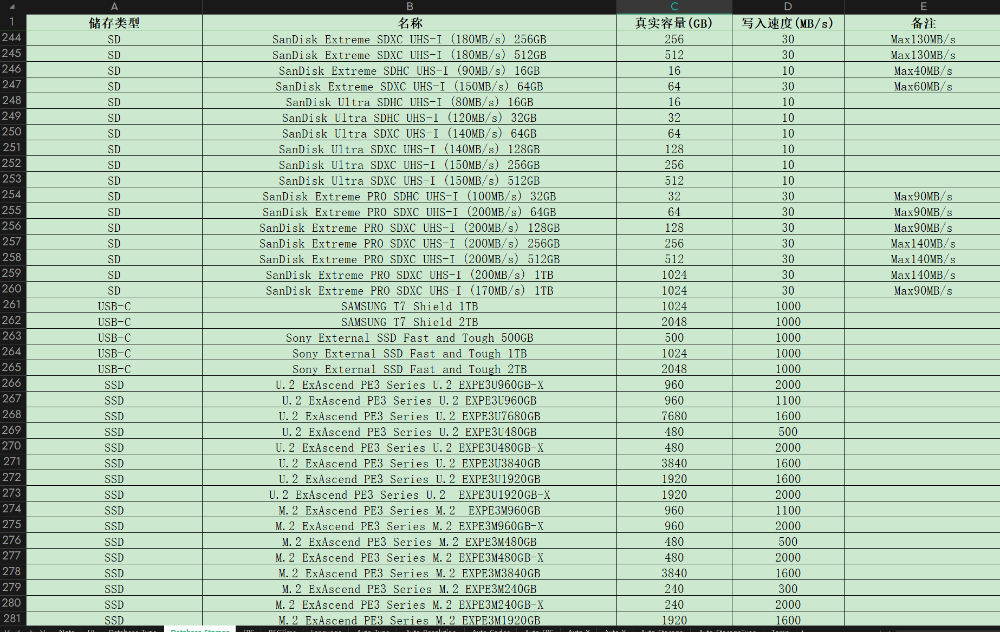

# 视频编码数据计算器

英文名：Video Codec Rate Calculator

用途：一款强大的工具，适用于摄影师/DIT/编辑。使用 .xlsx 表格形式，你可以计算任何形式的视频数据，甚至是相机的RAW数据。并且你可以随时随地手动添加或删除任何数据。
 
​​

# 项目简介

## 功能

一个能够帮助影视行业从业者计算任何视频编码的大小、体积、存储预估时间的EXCEL表格，可以完全进行自定义数据库和使用方式。

## 特点

* 使用灵活，随时修改数据
* 完全离线，本地使用
* 包含摄影机视频编码数据库，以及存储方式数据库，可以自主添加收集想要计算的内容。
* 也可以放在WPS云文档中，随时通过手机、平板、等任何能上网的设备进行调用，也可以通过微信小程序打开。
* 会使用EXCEL的用户也可以完全自定义修改公式以及使用方式。
* 中英文双语界面，可以随时修改/重新翻译文本，可以自主添加多种语言

## 适用用户

适合摄影师、剪辑师、DIT、特效师等从业者使用。

# 使用方式

​​

## 简单使用

直接像编辑表格一样编辑、修改、添加任何数据，表格中已经将各种数据类型填入，只要仿照着填写即可。

​​

​​

# 可以查找数据的网站

1. [https://www.cined.com/camera-database/](https://www.cined.com/camera-database/)
2. [https://www.red.com/tools#recording-time](https://www.red.com/tools#recording-time)
3. [https://tools.arri.com/fileadmin/adapps/afdc/index.html](https://tools.arri.com/fileadmin/adapps/afdc/index.html)
4. [https://www.dpreview.com/products/cameras](https://www.dpreview.com/products/cameras)
5. [https://www.blackmagicdesign.com/products](https://www.blackmagicdesign.com/products)
6. [https://phfx.com/tools/framesToDataRate/](https://phfx.com/tools/framesToDataRate/)
7. [https://www.atomos.com/compatible-cameras/](https://www.atomos.com/compatible-cameras/)

‍

‍
